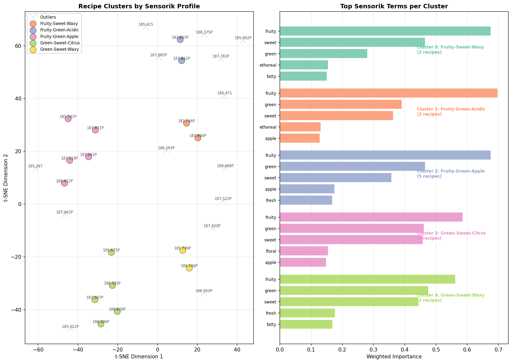
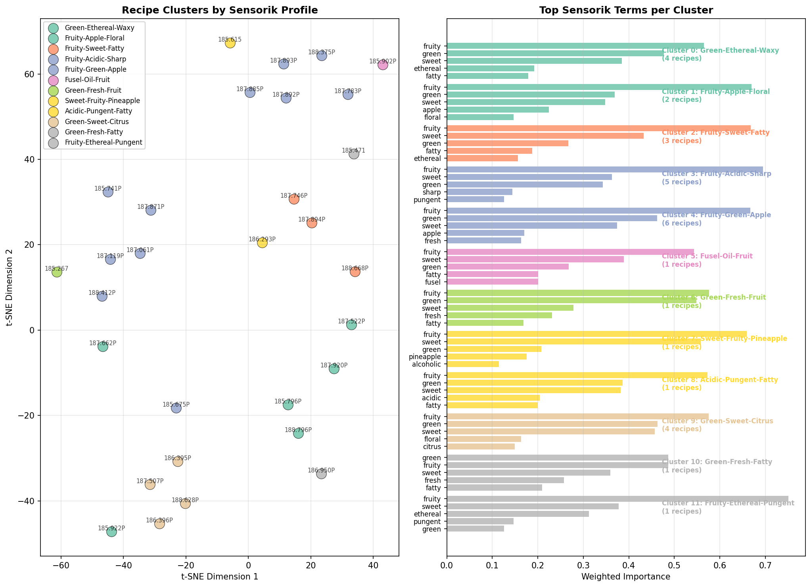
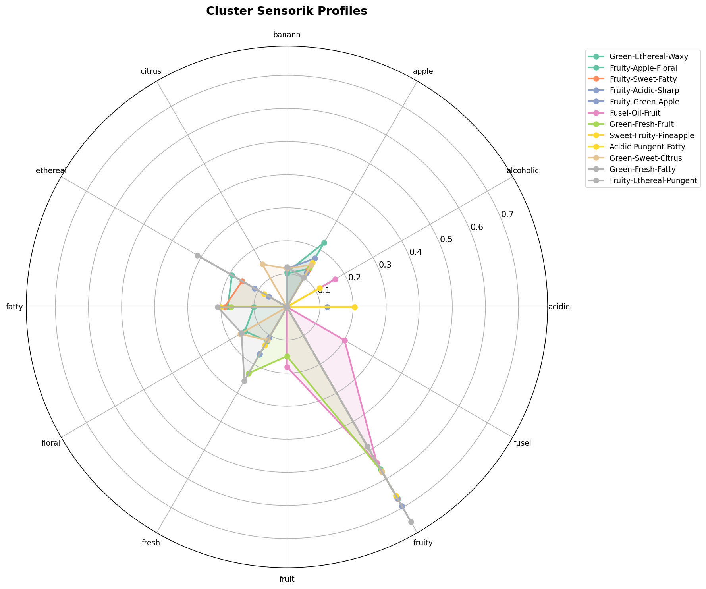
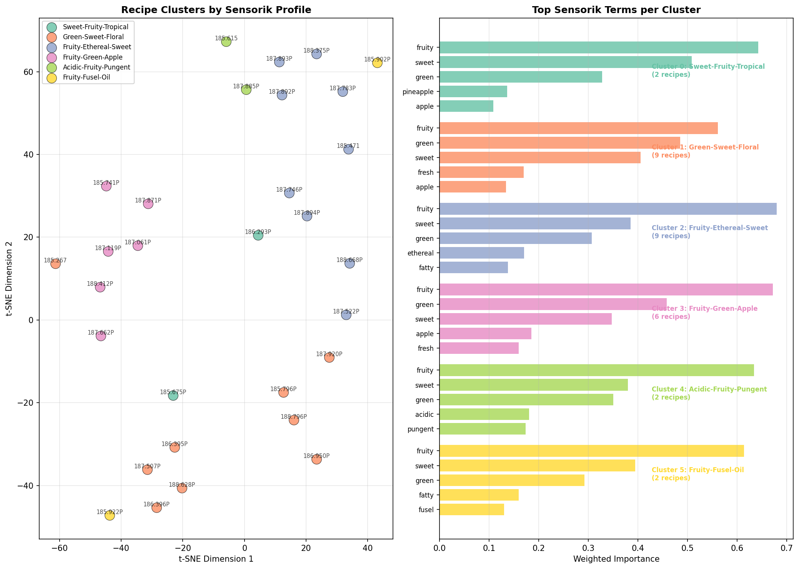
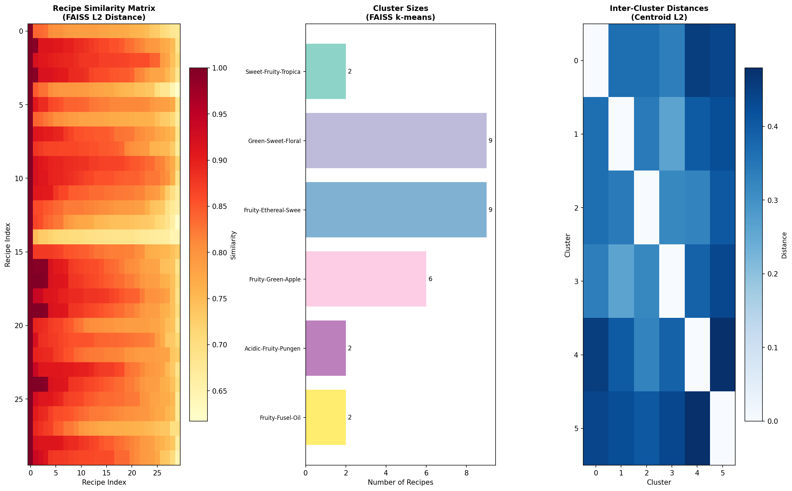
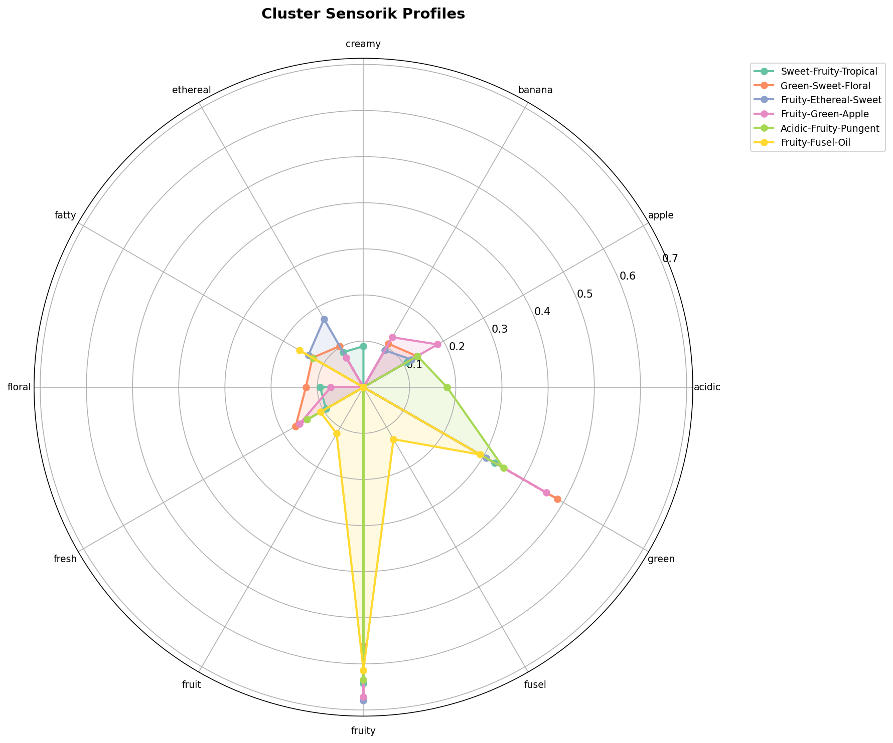

# Recipe Clustering Methods

This document explains the three clustering approaches implemented for grouping recipes based on their sensorik (odor) profiles.

## Table of Contents

1. [Overview](#overview)
2. [Data Structure](#data-structure)
3. [Weighted Importance](#weighted-importance)
4. [Method 1: HDBSCAN](#method-1-hdbscan)
5. [Method 2: Agglomerative Clustering](#method-2-agglomerative-clustering)
6. [Method 3: FAISS Vector Database](#method-3-faiss-vector-database)
7. [Comparison Table](#comparison-table)
8. [Choosing the Right Method](#choosing-the-right-method)
9. [Creating New Recipes](#creating-new-recipes)

---

## Overview

The goal is to cluster **30 strawberry aroma recipes** based on their sensorik profiles. Each recipe contains multiple ingredients, and each ingredient has up to 16 sensorik descriptors (Sensorik_1 to Sensorik_16) that describe its odor characteristics.

**Key Challenge**: The sensorik columns have descending importance:
- **Sensorik_1** = Most identifiable odor (highest importance)
- **Sensorik_16** = Least identifiable odor (lowest importance)

---

## Data Structure

| Column | Description | Example |
|--------|-------------|---------|
| Rez.-Nr. | Recipe identifier | 186.293P |
| Sensorik_1 | Primary odor descriptor | "fruity" |
| Sensorik_2 | Secondary odor descriptor | "sweet" |
| ... | ... | ... |
| Sensorik_16 | Tertiary odor descriptor | "woody" |

**Statistics**:
- Total rows: 840 (ingredient entries)
- Unique recipes: 30
- Unique sensorik descriptors: 242

---

## Weighted Importance

All three methods use the same weighted feature extraction to preserve sensorik importance:

```
Weight(position) = (17 - position) / 16

Sensorik_1  → weight = 1.000 (100% importance)
Sensorik_2  → weight = 0.9375
Sensorik_3  → weight = 0.875
...
Sensorik_16 → weight = 0.0625 (6.25% importance)
```

For each recipe, we:
1. Aggregate all sensorik terms from all ingredients
2. Sum the position-weighted occurrences of each term
3. L2-normalize the resulting vector

This creates a **242-dimensional vector** for each recipe where dimensions correspond to unique sensorik terms.

---

## Method 1: HDBSCAN

### Algorithm

**HDBSCAN** (Hierarchical Density-Based Spatial Clustering of Applications with Noise) is a density-based clustering algorithm that:
- Automatically determines the number of clusters
- Identifies outliers (recipes that don't fit any cluster)
- Does not force all points into clusters

### Parameters

| Parameter | Value | Description |
|-----------|-------|-------------|
| min_cluster_size | 2 | Minimum recipes to form a cluster |
| min_samples | 1 | Conservativeness of clustering |
| metric | euclidean | Distance metric |

### Results

```
Clusters found: 5
Outliers: 14 (47%)

Cluster 0: Fruity-Sweet-Waxy (2 recipes)
Cluster 1: Fruity-Green-Acidic (2 recipes)
Cluster 2: Fruity-Green-Apple (5 recipes)
Cluster 3: Green-Sweet-Citrus (5 recipes)
Cluster 4: Green-Sweet-Waxy (2 recipes)
```

### Plot Explanation



**Left Panel: t-SNE Cluster Map**
- Each point represents a recipe projected into 2D space using t-SNE dimensionality reduction
- Points close together have similar sensorik profiles
- Colors indicate cluster membership
- Gray X markers indicate outliers (recipes with unique profiles that don't cluster well)

**Right Panel: Top Sensorik Terms per Cluster**
- Horizontal bar chart showing the most important sensorik terms for each cluster
- Bar length = weighted importance of that term in the cluster
- Helps understand what makes each cluster distinctive

### Pros and Cons

| Pros | Cons |
|------|------|
| No need to specify k | High outlier rate (47%) |
| Finds natural groupings | Some clusters very small |
| Identifies truly unique recipes | Less useful for recipe creation |

---

## Method 2: Agglomerative Clustering

### Algorithm

**Agglomerative Clustering** is a hierarchical clustering method that:
- Starts with each recipe as its own cluster
- Iteratively merges the closest clusters
- Uses silhouette score to find optimal number of clusters
- **Guarantees all recipes are assigned** (no outliers)

### Parameters

| Parameter | Value | Description |
|-----------|-------|-------------|
| k_range | (3, 12) | Range of clusters to evaluate |
| metric | euclidean | Distance metric |
| linkage | ward | Minimizes within-cluster variance |

### Automatic k Selection

The algorithm tests different values of k and selects the one with the highest **silhouette score**:

```
k=3:  0.153
k=4:  0.131
k=5:  0.155
k=6:  0.160
k=7:  0.171
k=8:  0.174
k=9:  0.172
k=10: 0.181
k=11: 0.184
k=12: 0.184  ← Selected (highest)
```

### Results

```
Clusters found: 12
Outliers: 0

Cluster 0:  Green-Ethereal-Waxy (4 recipes)
Cluster 1:  Fruity-Apple-Floral (2 recipes)
Cluster 2:  Fruity-Sweet-Fatty (3 recipes)
Cluster 3:  Fruity-Acidic-Sharp (5 recipes)
Cluster 4:  Fruity-Green-Apple (6 recipes)
Cluster 5:  Fusel-Oil-Fruit (1 recipe) - Singleton
Cluster 6:  Green-Fresh-Fruit (1 recipe) - Singleton
Cluster 7:  Sweet-Fruity-Pineapple (1 recipe) - Singleton
Cluster 8:  Acidic-Pungent-Fatty (1 recipe) - Singleton
Cluster 9:  Green-Sweet-Citrus (4 recipes)
Cluster 10: Green-Fresh-Fatty (1 recipe) - Singleton
Cluster 11: Fruity-Ethereal-Pungent (1 recipe) - Singleton
```

### Plot Explanation



**Left Panel: t-SNE Cluster Map**
- All 30 recipes are assigned to clusters (no gray X markers)
- More colors visible due to higher cluster count (12 vs 5)
- Singletons (1-recipe clusters) appear as isolated points with unique colors

**Right Panel: Top Sensorik Terms per Cluster**
- More granular breakdown of sensorik profiles
- Singleton clusters show very specific/unique profiles
- Useful for identifying recipes with distinctive characteristics

### Radar Chart



**Radar Chart Explanation**:
- Each colored line represents a cluster's sensorik "fingerprint"
- Axes represent different sensorik terms
- Distance from center = importance of that term
- Overlapping areas = shared characteristics
- Divergent spikes = distinctive features

### Pros and Cons

| Pros | Cons |
|------|------|
| No outliers - all recipes assigned | Many singleton clusters (6 out of 12) |
| Fine-grained categorization | May over-segment the data |
| Automatic k selection | Singletons less useful for averaging |

---

## Method 3: FAISS Vector Database

### Algorithm

**FAISS** (Facebook AI Similarity Search) is a library for efficient similarity search that:
- Stores recipe vectors in an optimized index
- Enables fast nearest-neighbor queries
- Uses k-means for clustering
- Provides similarity search capabilities for recipe creation

### Parameters

| Parameter | Value | Description |
|-----------|-------|-------------|
| k_range | (4, 12) | Range of clusters to evaluate |
| niter | 50 | K-means iterations |
| index_type | IndexFlatL2 | Exact L2 distance search |

### Results

```
Clusters found: 6
Outliers: 0
Silhouette score: 0.112

Cluster 0: Sweet-Fruity-Tropical (2 recipes)
Cluster 1: Green-Sweet-Floral (9 recipes)
Cluster 2: Fruity-Ethereal-Sweet (9 recipes)
Cluster 3: Fruity-Green-Apple (6 recipes)
Cluster 4: Acidic-Fruity-Pungent (2 recipes)
Cluster 5: Fruity-Fusel-Oil (2 recipes)
```

### Plot Explanation



**Left Panel: t-SNE Cluster Map**
- Balanced cluster distribution (no extreme singletons)
- Two large clusters (9 recipes each) capture the most common profiles
- Four smaller clusters capture specialized characteristics

**Right Panel: Top Sensorik Terms per Cluster**
- Cleaner separation between cluster profiles
- Each cluster has a distinct "signature"

### FAISS-Specific Visualizations



**Left: Recipe Similarity Matrix**
- Heatmap showing pairwise similarity between all 30 recipes
- Darker red = more similar recipes
- Visible block patterns indicate natural groupings
- Useful for identifying which recipes could be blended

**Middle: Cluster Sizes**
- Bar chart showing recipe count per cluster
- Two dominant clusters (Green-Sweet-Floral and Fruity-Ethereal-Sweet)
- Four smaller specialized clusters

**Right: Inter-Cluster Distances**
- Heatmap showing distances between cluster centroids
- Darker blue = clusters are more different
- Useful for recipe blending: mixing distant clusters creates more contrast
- Cluster 4 (Acidic-Fruity-Pungent) is most distant from others

### Radar Chart



- 6 distinct cluster profiles
- Yellow line (Acidic-Fruity-Pungent) shows unique spike in "acidic" dimension
- Green line (Green-Sweet-Floral) dominates "green" and "fresh" dimensions

### FAISS-Specific Features

**1. Similarity Search**
```python
# Find recipes similar to a specific recipe
similar = clusterer.find_similar_recipes(recipe_idx=0, top_k=5)
```

**2. Profile-Based Search**
```python
# Find recipes matching a target sensorik profile
results = clusterer.find_recipes_by_profile({
    'fruity': 0.8,
    'tropical': 0.4,
    'pineapple': 0.3
}, top_k=5)
```

**3. New Recipe Creation with Validation**
```python
# Create new recipe and find similar existing recipes
profile, terms, similar = clusterer.create_new_recipe_profile_faiss({
    0: 0.7,  # 70% Sweet-Fruity-Tropical
    1: 0.3   # 30% Green-Sweet-Floral
})
```

### Pros and Cons

| Pros | Cons |
|------|------|
| No outliers | Lower silhouette score (0.112) |
| Balanced cluster sizes | Requires additional dependency |
| Similarity search capability | K-means may not capture complex shapes |
| Fast nearest-neighbor queries | Warnings with small datasets |
| Best for recipe creation workflow | |

---

## Comparison Table

| Aspect | HDBSCAN | Agglomerative | FAISS |
|--------|---------|---------------|-------|
| **Clusters Found** | 5 | 12 | 6 |
| **Outliers** | 14 (47%) | 0 | 0 |
| **Singletons** | 0 | 6 | 0 |
| **Silhouette Score** | N/A | 0.184 | 0.112 |
| **Automatic k** | Yes | Yes | Yes |
| **Similarity Search** | No | No | Yes |
| **Preserves Importance** | Yes | Yes | Yes |
| **Best Cluster Balance** | No | No | Yes |
| **Identifies Unique Recipes** | Yes | Yes | No |

### Cluster Distribution Comparison

| Cluster Size | HDBSCAN | Agglomerative | FAISS |
|--------------|---------|---------------|-------|
| 1 recipe | 0 | 6 | 0 |
| 2 recipes | 4 | 2 | 3 |
| 3-5 recipes | 1 | 2 | 1 |
| 6+ recipes | 0 | 2 | 2 |
| Outliers | 14 | 0 | 0 |

---

## Choosing the Right Method

### Use HDBSCAN when:
- You want to identify truly unique/outlier recipes
- You're exploring the data to understand its structure
- You don't need all recipes in clusters
- You want conservative, high-confidence clusters

### Use Agglomerative when:
- You need all recipes assigned to clusters
- You want fine-grained categorization
- You're interested in identifying singleton recipes with unique profiles
- You need hierarchical relationships between clusters

### Use FAISS when:
- You plan to create new recipes by blending clusters
- You need similarity search capabilities
- You want balanced, meaningful cluster sizes
- You're building a production system for recipe recommendation
- You need to query "find recipes similar to X"

---

## Creating New Recipes

All three methods support creating new recipe profiles by averaging cluster centroids:

```python
# Basic approach (HDBSCAN/Agglomerative)
profile, top_terms = clusterer.create_new_recipe_profile({
    0: 0.6,  # 60% from cluster 0
    1: 0.4   # 40% from cluster 1
})

# FAISS approach (with validation)
profile, top_terms, similar_recipes = clusterer.create_new_recipe_profile_faiss({
    0: 0.7,
    1: 0.3
})
# Returns similar existing recipes for validation
```

### Example Output

```
Mixing:
  70% Cluster 0 (Sweet-Fruity-Tropical)
  30% Cluster 1 (Green-Sweet-Floral)

New Recipe Target Sensorik Profile:
  fruity          ████████████████████████████████ (0.645)
  sweet           ████████████████████████ (0.499)
  green           ███████████████████ (0.392)
  pineapple       ██████ (0.125)
  fresh           ██████ (0.122)
  apple           ██████ (0.121)

Most Similar Existing Recipes:
  • 185.675P (distance: 0.0341)
  • 186.396P (distance: 0.0764)
```

---

## Usage

```python
from recipe_clustering import RecipeClusterer

# Initialize
clusterer = RecipeClusterer('data/gold/Versuchsdaten.csv')

# Run desired pipeline
results = clusterer.run_full_pipeline()           # HDBSCAN
results = clusterer.run_agglomerative_pipeline()  # Agglomerative
results = clusterer.run_faiss_pipeline()          # FAISS
```

---

## Files

| File | Description |
|------|-------------|
| `src/clustering/recipe_clustering.py` | Main implementation |
| `outputs/cluster_visualization.png` | HDBSCAN plots |
| `outputs/cluster_profiles.png` | HDBSCAN radar chart |
| `outputs/cluster_agglomerative.png` | Agglomerative plots |
| `outputs/cluster_agglomerative_profiles.png` | Agglomerative radar |
| `outputs/cluster_faiss.png` | FAISS plots |
| `outputs/cluster_faiss_profiles.png` | FAISS radar |
| `outputs/cluster_faiss_similarity.png` | FAISS similarity analysis |
